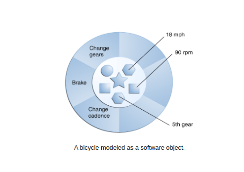
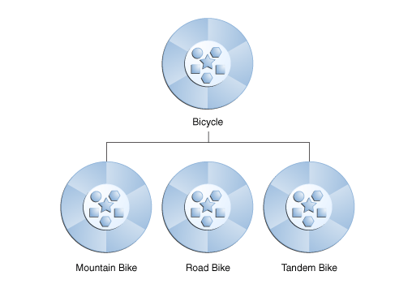

# Object Oriented Programming

**A computer programming paradigm known as object-oriented programming (OOP) arranges the architecture of software around data or objects rather than functions and logic.**

The principles of Object Oriented Programming are:
-  **Objects**
-  **Classes**
-  **Inheritance**
-  **Abstraction** 
-  **Encapsulation**
-  **Polymorphism**


### **Objects**
 The key to understanding object-oriented technology is objects. Right now, there are numerous examples of things that exist in the real world: your dog, your desk, your television, and your bicycle.
 Real-world **objects** share two characteristics: 
 Each of them has a state and behaviour. A dog's status (name, colour, breed, and level of hunger) and demeanour (barking, fetching, wagging tail). Additionally, bicycles have states (current gear, pedal cadence, and speed) and behaviours (changing gear, changing pedal cadence, applying brakes). A great method to start thinking about object-oriented programming is to identify the state and behaviour of real-world objects.



### **Classes**
 A class serves as a template or model from which objects can be made. It stands for the collection of attributes or operations that are shared by all objects of a particular type.
 A class implementation
```
class Bicycle {

    int cadence = 0;
    int speed = 0;
    int gear = 1;

    void changeCadence(int newValue) {
         cadence = newValue;
    }

    void changeGear(int newValue) {
         gear = newValue;
    }

    void speedUp(int increment) {
         speed = speed + increment;   
    }

    void applyBrakes(int decrement) {
         speed = speed - decrement;
    }

    void printStates() {
         System.out.println("cadence:" + cadence + " speed:" + speed + " gear:" + gear);
    }
}
```

### **Inheritance**
 An essential OOP tenet is inheritance (Object Oriented Programming). It is the mechanism that allows one class to inherit the characteristics (fields and methods) of another class.
 Classes can inherit frequently used states and behaviour from other classes in object-oriented programming. In this illustration, the bicycle is now the superclass of tandem, road, and mountain bikes. Each class in the Java programming language may have a single direct superclass, and each superclass may have an infinite number of subclasses.



```
class MountainBike extends Bicycle {

    int fronttravel = 0;
    int rear travel = 0;

    void frontShocks(int value) {
        frontravel = value;
    }

    void rearshocks(int value) {
        reartravel = value;
    }

    void printTravel() {
        System.out.println("Front Travel:" +fronttravel+ "" Rear Travel:" +reartravel);
    }

}
```

### **Abstraction**
 The characteristic of data abstraction ensures that the user sees just the most important information. The user does not see the unnecessary or insignificant units. Identifying only the necessary aspects of an object while discarding the unnecessary elements is another definition of data abstraction.
 An example is a bicycle. A bicycle is viewed as a bicycle rather than its individual components as wheels and cranks.

```
class Bicycle {

    int frame = 0;
    int wheelsize = 0;
    String size = "";
    
    void mediumSize(int fvalue, wvalue) {
        frame = fvalue;
        wheelsize = wvalue;
        size = "medium";
    }
    
    void smallSize() {
        frame = fvalue;
        wheelsize = wvalue;
        size = "small";
    }
    
    void largeSize() {
        frame = fvalue;
        wheelsize = wvalue;
        size = "large";
    }
    
    void printSize() {
        System.out.println("Size:" +size);
    }
    
}
```

### **Encapsulation**
 It is described as the collection of data into a single entity. It is the mechanism that connects the code to the data that it works with. Encapsulation can also be viewed as a barrier that stops code from the outside of the barrier from accessing the data.
 Encapsulation can be accomplished by writing public methods in the class to set and get the values of the variables and by declaring all of the variables in the class as private.

```
class Bicycle {
    
    private String bicyclename;
    private String model;
    
    public String getname() {
        return bicyclename;
    }
    
    public String getmodel() {
        return model;
    } 
    
    public void setname(String newname) {
        bicyclename = newname;
    }
    
    public void setmodel(String model) {
        model = newmodel;
    }
    
    public printname() {
        Bicycle bi = new Bicycle();
        bi.setname("RockRider");
        bi.setmodel("ST 30");
        
        System.out.println("Bicycle name:" bi.getname());
        System.out.println("Bicycle model:" bi.getmodel());
    }
}
```

### **Polymorphism**
Polymorphism refers to the existence of various forms. Polymorphism can be simply defined as a message's capacity to be presented in multiple forms.


 A bicycle can be either road bike, mountain bike or hybrid bike. Bicycle can have many forms.

```
class Bicycle {

    public String bicycleType(String gears) {
        gears = "Single";
        return gears;
    }
    
    public int bicycleType(int gears) {
        gears = 7;
        return gears;
    }
    
    public bicycleTypeprint() {
        System.out.println("Is a " +gears+ "cycle");
    }
}
```

### References
*  [Oracle: Object Oriented Programming Concepts](https://docs.oracle.com/javase/tutorial/java/concepts/index.html)
*  [Geeks for Geeks: Oops Concepts](https://www.geeksforgeeks.org/object-oriented-programming-oops-concept-in-java/)
*  [Mozilla Org: Object Oriented Programming](https://developer.mozilla.org/en-US/docs/Learn/JavaScript/Objects/Object-oriented_programming)